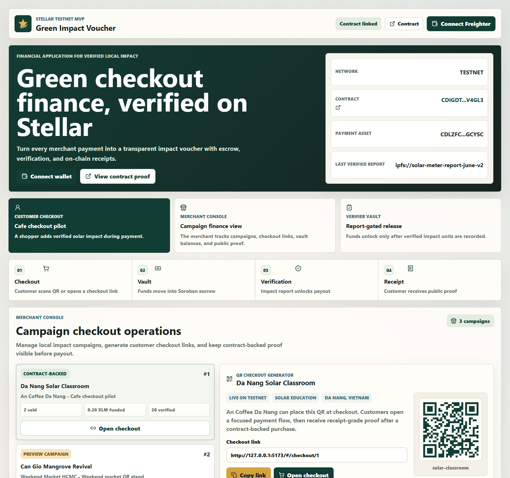
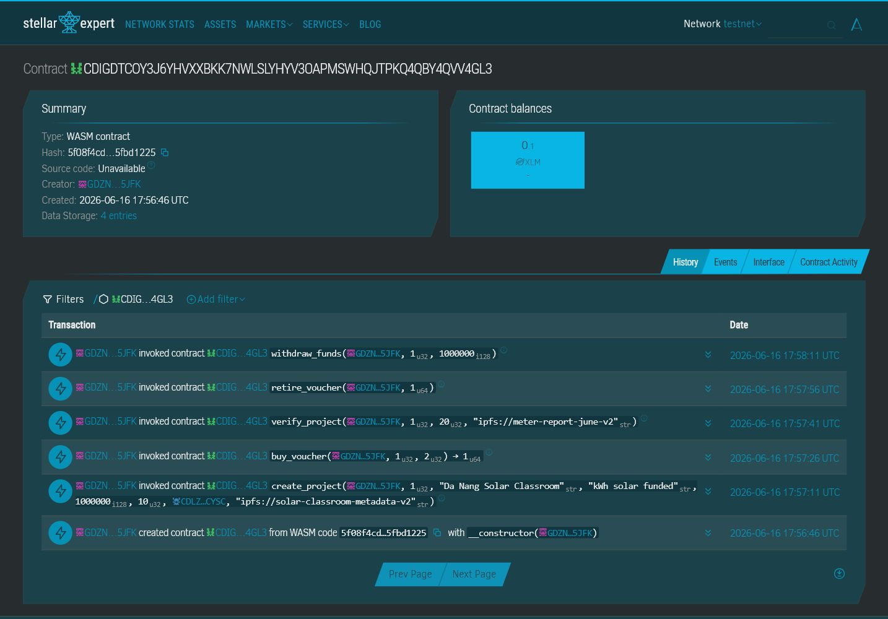

# Green Impact Voucher

Green Impact Voucher is a green checkout finance dApp verified on Stellar. It lets local merchants, events, and SMEs turn small customer payments into verified environmental impact vouchers with smart contract vault custody, report-gated release, and receipt-grade customer proof.

## UI Preview

The React frontend presents the product as a fintech checkout workflow: Customer Checkout, Merchant Console campaign list, scannable QR checkout links, Verifier Vault, smart contract proof, escrowed vault balance, and receipt-state customer proof.



## Specific Problem

Coffee shops, campus events, retailers, and SMEs want customers to support local green campaigns at checkout, but the current options are usually donation boxes, bank-transfer QR codes, or private ESG reports. Customers cannot verify whether their money reached the project, merchants cannot prove impact to their community, and project owners lack a low-cost way to publish auditable delivery proof.

## Solution

Green Impact Voucher turns each checkout contribution into an on-chain impact voucher. Customer funds enter a Soroban smart contract vault first, impact is verified with a report hash, the customer receives a receipt-like voucher, and the project owner can withdraw funds only after verification.

## Financial Application Positioning

This is not only a climate dashboard. It is a user-facing financial application for verified local impact funding:

- Customer: adds a small green voucher payment during checkout.
- Merchant: runs a local green campaign and uses on-chain proof for ESG/community reporting.
- Project owner: receives funds through a conditional vault release instead of direct unverified payout.
- Verifier/admin: confirms delivered impact before funds are unlocked.

Example transaction: a customer at a Da Nang cafe pays `0.10 XLM` for a `Solar Classroom Voucher`, funding `10 kWh of verified solar energy`. The payment goes to the contract vault, the voucher is recorded on-chain, and payout happens only after the solar impact report is verified.

## Why Stellar

Stellar makes this use case practical because fees are low enough for micro-contributions, settlement is fast, native assets are available through Stellar Asset Contracts, and Soroban contracts can store transparent proof without a centralized backend.

## Key Features

- Real payment flow using the native XLM Stellar Asset Contract on Testnet.
- Contract vault custody: voucher purchases transfer payment into the contract.
- Verified release: project owner can withdraw funds only after impact is verified.
- Customer checkout, merchant console, verifier vault, and impact receipt surfaces in the UI.
- Merchant campaign list with scannable QR checkout links and route-like customer checkout state.
- Voucher lifecycle: create project, buy voucher, verify impact, retire voucher, withdraw funds.
- Typed Soroban storage keys, typed custom errors, TTL extension, and structured events.
- Freighter-connected React dashboard with Stellar Expert transaction links.
- README and demo script include Testnet proof for judging.

## User-Facing Transaction Flow

1. Merchant or project owner launches a campaign such as `Da Nang Solar Classroom`.
2. Merchant shares a QR/link checkout for the campaign.
3. Customer buys a green checkout voucher worth `0.10 XLM`.
4. The contract transfers payment from the customer into the vault.
5. The UI moves from quote state to receipt state with buyer, campaign, impact units, paid amount, transaction, and verification status.
6. Owner/admin verifies delivered impact with a report hash.
7. Customer retires the voucher as public proof of funded impact.
8. Project owner withdraws verified funds from the vault.

## Contract Detail

- Network: Stellar Testnet
- Contract ID: `CDIGDTCOY3J6YHVXXBKK7NWLSLYHYV3OAPMSWHQJTPKQ4QBY4QVV4GL3`
- Payment token: Native XLM Stellar Asset Contract `CDLZFC3SYJYDZT7K67VZ75HPJVIEUVNIXF47ZG2FB2RMQQVU2HHGCYSC`
- Admin/deployer: `GDZN36SJ6LJURNUNBW47MQF3DZQDAOGSTZIQVABZLMOVJLN4HZZE5JFK`
- WASM hash: `5f08f4cd86250170386d2d904c5ee69fe48a801ed3b2eb5becf4ed395fbd1225`
- WASM size: `13,403 bytes`
- Contract Explorer: <https://stellar.expert/explorer/testnet/contract/CDIGDTCOY3J6YHVXXBKK7NWLSLYHYV3OAPMSWHQJTPKQ4QBY4QVV4GL3>



## Stellar Testnet Proof

| Step | Transaction |
| --- | --- |
| WASM upload | <https://stellar.expert/explorer/testnet/tx/1e72f62f3f2e67ddce22b49be1fdcbcfa8bba19f064cf8956f023b9d86b404ea> |
| Deploy contract | <https://stellar.expert/explorer/testnet/tx/21141e51c1945035d66bbebd22da66aff369ba842cd3e3469d6564303c118c84> |
| Create project | <https://stellar.expert/explorer/testnet/tx/d3280934101aa3e21da70c0885d3c23aa33a24864be3ab4e3f1ce496188adaa9> |
| Buy voucher | <https://stellar.expert/explorer/testnet/tx/472998d13bce42752cd682ae63b074f21348c6ffec719a23de79348398f51702> |
| Verify project | <https://stellar.expert/explorer/testnet/tx/bfe5b3cfa4a2b5e52d236ab20c801cefee685880dfc5a837f2fc24927a65952c> |
| Retire voucher | <https://stellar.expert/explorer/testnet/tx/8f2a42d3a58291cf19d1b3b39d536fc2e490a3a87c24d5d8ac0163aa0420744b> |
| Withdraw funds | <https://stellar.expert/explorer/testnet/tx/cea81936292151d40393a9eba007f71e24408e826fdf96ff4363c811094ca3b5> |

The `buy_voucher` transaction transfers `2,000,000` stroops from the buyer to the contract. The `withdraw_funds` transaction transfers `1,000,000` stroops from the contract vault back to the project owner after verification.

## Tech Stack

- Smart contract: Rust, Soroban SDK v26
- Blockchain: Stellar Testnet
- Frontend: React, Vite, vanilla CSS
- Wallet: Freighter via `@stellar/freighter-api`
- SDK: `@stellar/stellar-sdk`

## Repository Structure

```text
GreenImpactVoucher/
|-- contracts/
|   `-- impact_voucher/
|       |-- Cargo.toml
|       `-- src/
|           |-- lib.rs
|           `-- test.rs
|-- frontend/
|   |-- public/
|   `-- src/
|-- docs/
|   |-- screenshots/
|   `-- demo-script.md
|-- scripts/
|   `-- verify.ps1
|-- Cargo.toml
|-- Makefile
|-- README.md
`-- .gitignore
```

## Smart Contract Functions

| Function | Purpose |
| --- | --- |
| `__constructor(admin)` | Stores the project admin at deployment time. |
| `admin()` | Reads the current admin address. |
| `set_admin(current_admin, new_admin)` | Transfers admin control and emits `AdminChanged`. |
| `create_project(...)` | Registers an impact project and its payment token. |
| `buy_voucher(buyer, project_id, quantity)` | Transfers payment into the vault and mints an ownership record. |
| `verify_project(verifier, project_id, verified_units, report_hash)` | Lets owner or admin verify delivered impact. |
| `retire_voucher(owner, voucher_id)` | Retires verified impact owned by a voucher holder. |
| `withdraw_funds(owner, project_id, amount)` | Lets project owner withdraw verified project funding. |
| `project(project_id)` | Reads project state. |
| `voucher(voucher_id)` | Reads voucher state. |
| `holding(project_id, owner)` | Reads aggregate holder state. |

## Local Development

Install the current Stellar smart contract toolchain:

```bash
rustup target add wasm32v1-none
cargo install --locked stellar-cli
```

On Windows, the official Stellar CLI installer or `winget` can also be used:

```powershell
winget install --id Stellar.StellarCLI
```

Run contract checks:

```bash
cargo test
stellar contract build --package impact-voucher
```

Run frontend:

```bash
cd frontend
npm install
npm run dev
```

Copy `frontend/.env.example` to `frontend/.env` for local frontend contract calls:

```text
VITE_CONTRACT_ID=CDIGDTCOY3J6YHVXXBKK7NWLSLYHYV3OAPMSWHQJTPKQ4QBY4QVV4GL3
VITE_PAYMENT_TOKEN_ID=CDLZFC3SYJYDZT7K67VZ75HPJVIEUVNIXF47ZG2FB2RMQQVU2HHGCYSC
```

Quick commands:

```bash
make test
make build-contract
make frontend-build
make frontend-lint
make verify
```

Windows verification:

```powershell
.\scripts\verify.ps1
```

## Testnet Deployment Notes

Create and fund a Testnet identity:

```bash
stellar keys generate deployer --network testnet --fund
stellar keys address deployer
```

Build and deploy:

```bash
stellar contract build --package impact-voucher
stellar contract deploy \
  --wasm target/wasm32v1-none/release/impact_voucher.wasm \
  --source-account deployer \
  --network testnet \
  --alias green-impact-voucher \
  -- \
  --admin "$(stellar keys address deployer)"
```

Get the native XLM Stellar Asset Contract ID for Testnet:

```bash
stellar contract id asset --asset native --network testnet
```

Example invoke:

```bash
CONTRACT_ID="YOUR_CONTRACT_ID"
DEPLOYER="$(stellar keys address deployer)"
PAYMENT_TOKEN="YOUR_PAYMENT_TOKEN_CONTRACT_ID"

stellar contract invoke \
  --id "$CONTRACT_ID" \
  --source-account deployer \
  --network testnet \
  -- create_project \
  --owner "$DEPLOYER" \
  --project_id 1 \
  --title "Da Nang Solar Classroom" \
  --impact_unit "kWh of verified solar energy" \
  --price_per_voucher 1000000 \
  --unit_per_voucher 10 \
  --payment_token "$PAYMENT_TOKEN" \
  --metadata_hash "ipfs://solar-classroom-metadata"
```

## Quality Gates

- `cargo test`: 12 tests passing.
- `stellar contract build --package impact-voucher`: success.
- WASM size: 13,403 bytes, under the 64KB bootcamp guideline.
- `npm run build`: success.
- `npm run lint`: success.
- `npm audit --omit=dev`: 0 vulnerabilities.
- No private keys are stored in this repository.
- `.env`, `target`, `frontend/dist`, and `frontend/node_modules` are ignored.

## Security Notes

- Every state-changing function requires auth from the affected address.
- Admin operations read admin from storage instead of hardcoding addresses.
- Project and voucher data use typed Soroban storage keys.
- Persistent entries and instance storage extend TTL after writes.
- Contract events are emitted for project creation, purchase, verification, retirement, withdrawal, and admin transfer.
- Arithmetic uses checked operations for funded amount, voucher count, impact units, and withdrawals.

## References Used

- Stellar Developer Docs: <https://developers.stellar.org>
- Soroban Smart Contracts: <https://developers.stellar.org/docs/build/smart-contracts>
- Scaffold Stellar: <https://scaffoldstellar.org>
- Stellar Expert: <https://stellar.expert>
- Stellar Laboratory: <https://laboratory.stellar.org>
- Stellar Community Fund: <https://communityfund.stellar.org>
- Bootcamp reference: <https://github.com/minhbear/soroban-bootcamp>
- Comparison reference: <https://github.com/minhbear/ChainSubscription-Hub>
- Previous project reference: <https://github.com/ngainhau1/solar_stake>

## Submission Materials

- Submission form draft: [docs/submission-form.md](docs/submission-form.md)
- Judging map: [docs/judging-map.md](docs/judging-map.md)
- Vietnamese pitch: [docs/submission-vi.md](docs/submission-vi.md)
- Demo script: [docs/demo-script.md](docs/demo-script.md)
- Demo video outline: [docs/demo-video-outline.md](docs/demo-video-outline.md)
- Final submission checklist: [docs/final-submission-checklist.md](docs/final-submission-checklist.md)
- Frontend screenshot: [docs/screenshots/frontend-dashboard.png](docs/screenshots/frontend-dashboard.png)
- Stellar Expert screenshot: [docs/screenshots/stellar-expert-contract.png](docs/screenshots/stellar-expert-contract.png)

## Future Scope

- Add oracle-backed meter reports from solar inverters.
- Support multiple impact categories such as solar, clean water, and public transit.
- Add a project registry with off-chain metadata indexing.
- Add voucher transfer support before retirement.
- Package the project for Stellar Community Fund submission.

## Team

Team and contact details are managed through the Rise In hackathon profile and submission form rather than stored in this public repository.
